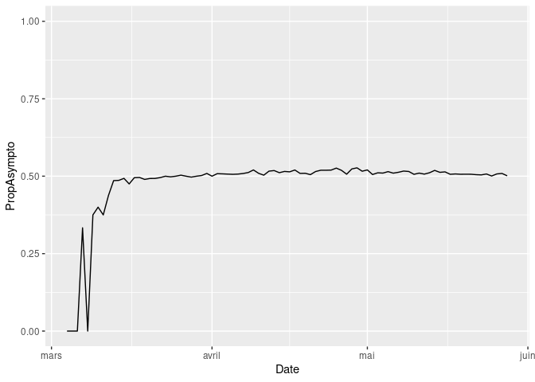

<!-- README.md is generated from README.Rmd. Please edit that file -->

<!-- badges: start -->
<!-- badges: end -->

# NpiEurope

This code is used to produce the results from the paper "Quantifying the efficiency of non-pharmaceutical interventions against SARS-COV-2 transmission in Europe", by Garchitorena et al (https://www.medrxiv.org/content/10.1101/2020.08.17.20174821v1)

## Installation

The development version can be installed from
[GitHub](https://github.com/) with:

``` r
# install.packages("remotes")
remotes::install_github("Bisaloo/NpiEurope")
```

## Example

``` r
library(NpiEurope)
```

Let’s first load the data we’ll need for this example. In this example,
we focus on the case of Poland.

``` r
country <- "Poland"
```

The functions `load_country_data()`, `load_contact_data()` and
`load_age_date()` are helpers for the handful of countries that have
been bundled with this package but you can provide your own dataframe
for `country_data`, `contact_data` and `age_data`. The
`load_country_data()` can also take an optional `dataset_path` arguments
where you can specify the path for the ECDC dataset in the case when the
version bundled with this package gets out of date.

``` r
country_data <- load_country_data(country)
#> Parsed with column specification:
#> cols(
#>   .default = col_double(),
#>   un = col_character(),
#>   Country = col_character(),
#>   Date = col_date(format = "")
#> )
#> See spec(...) for full column specifications.
country_data <- estimate_asympto(country_data)
plot_asympto(country_data)
```



``` r
contact_data <- load_contact_data(country)
#> New names:
#> * `` -> ...1
#> * `` -> ...2
#> * `` -> ...3
#> * `` -> ...4
#> * `` -> ...5
#> * ...
age_data <- load_age_data(country)
```

You can estimate epidemiological parameters (proportion of asymptomatic
cases `propAsympto`, transmission rate `transmRate` and efficiency of
the lockdowns `vecEff`) via the `LHS_init()` function which takes the
country as argument:

``` r
res <- LHS_init(country_data, contact_data, age_data, task = "estimate")
```

The number of particles and number of iterations for the MCMC can be
ajusted with the `Np` and `Niter` arguments respectively.

You can view the trace of the MCMC with:

``` r
plot_MCMC(res)
```

You can see the 95% credibility interval of each estimated parameter
with the function `summarise_estimation()`. This function prints the
credibility intervals:

``` r
summarise_estimation(res, country_data)
```

but also returns a table with these intervals so you can build a nice
table from it, e.g., with `knitr::kable()`:

``` r
knitr::kable(summarise_estimation(res, country_data))
```

and then visually compare the simulated trajectories from these
parameters with the empirical data. The `Npost` argument in
`simulate_trajectory()` specifies how many parameter values you want to
extract from the posterior distribution of the MCMC to run the
simulations:

``` r
sims <- simulate_trajectory(res,
                            country_data, contact_data, age_data,
                            Npost = 5)
plot_simulations(sims, country_data)
```
